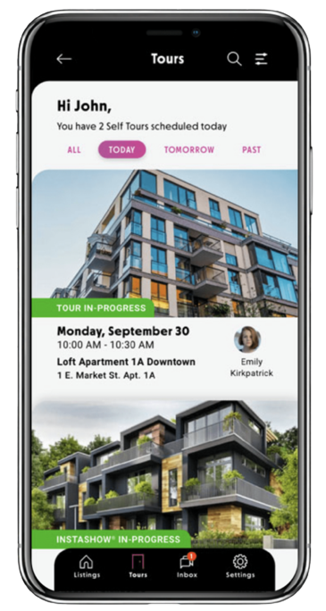
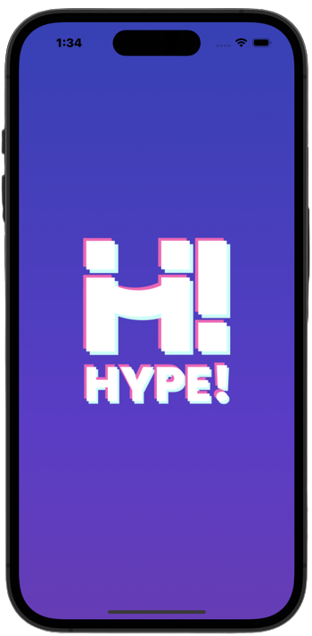
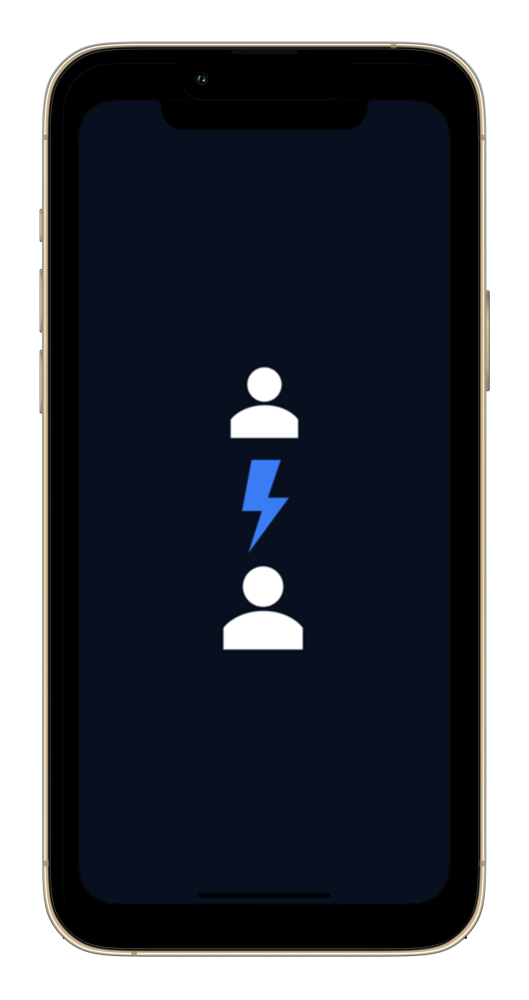

# **Ganesh Raju Galla**
  

### **iOS Developer**
_Andhra Pradesh, India (IST+5:30)_

Links:

* Contact: +91-7995791961
* E-mail: ganeshrajugalla@gmail.com
* LinkedIn: https://www.linkedin.com/in/ganeshrajugalla/
* GitHub: https://github.com/GaneshRajuGalla
* Medium: https://medium.com/@ganeshrajugalla
* StackOverflow: https://stackoverflow.com/users/15156897/ganesh-raju-galla
* Website: https://ganeshrajugalla.github.io/Resume/

### **About**
I have accumulated 2 years of experience in the software industry, encompassing evaluation, design, development, testing, maintenance, and production phases, all executed through the SDLC process and AGILE methodologies. My expertise includes constructing iOS Mobile applications utilizing Swift, SwiftUI, and CocoaTouch Frameworks.

- I possess experience working as an Associate Software Engineer and a Software Trainee.
- I have successfully participated in and contributed to the development of numerous projects across all stages, from inception to the production phase.
- I prioritize robust architectural practices and maintain precise nomenclature within my codebase.
- I have experience in developing and delivering iOS applications for both consumer-facing and enterprise-native purposes.
- I have experience working within the social media and IoT-based industries.
- I am an advocate for simplicity over complexity unless complexity is justified.
- I demonstrate a tendency to cautiously adopt new technologies, preferring to wait for their stability before implementation.
- I excel at building relationships and collaborating effectively with UI/UX teams, project managers, development teams, and clients. This collaboration ensures the successful development of applications.

### **Tech Stack**
- **Programming Languages**:
  - Swift-3.x/4.x/5.x, C, C++, Java, Python
    
- **Development Tools**:
  - X-Code-12/13/14/15, GIT, GitHub, GitLab, Bitbucket, Source Tree, Postman, Jira, Figma, AdobeXD, Zoho, CocoaPods, Swift Package Manager(SPM), Android Studio, Visual Studio
    
- **iOS Frameworks**:
  - ARKit, AVFoundation, AVKit, AssetsLibrary, AuthenticationServices, BackgroundTasks, Contacts, ContactsUI, CoreBluetooth, Combine, CoreLocation, HealthKit, HealthKitUI, LocalAuthentication, MapKit, MediaPlayer, Network, NetworkExtension, NotificationCenter, PDFKit, PencilKit, Photos, PhotosUI, ReplayKit, SafariServices, Speech, StoreKit, SwiftUI, UIKit, UserNotifications, UserNotificationsUI, Vision, VisionKit, WatchConnectivity, WebKit

- **Third Party Frameworks**:
  - Alamofire, AWSS3, Charts, Cloudinary, CryptoSwift, DataCache, FacebookCore, FacebookLogin, Firebase, Firebase/Analytics, Firebase/Crashlytics, FSCalendar, GoogleMaps, GoogleMobileAds, GooglePlaces, GoogleSignIn, IQKeyboardManager, Kingfisher, Lottie, MaterialComponents, mobile-ffmpeg-full, Mixpanel, Moya, Realm, RxSwift, SkyFloatingLabelTextField, Socket.IO, Stripe, SVProgressHUD, SwiftLint

### **Employment History**
| Period | Description |
| - | - |
| Apr 2022 — Present | Associate Software Engineer at [TechAhead](https://www.techaheadcorp.com/) |
| Oct 2021 — Apr 2022 | Software Trainee at [TechAhead](https://www.techaheadcorp.com/) |

### **Education History**
| Period | Description |
| - | - |
| 2018 - 2021 | Bachelor of Technology in Computer Science at [Krishna University](https://krucet.ac.in/)|
| 2014 - 2017 | Diploma of Education in Computer Science at [Andhra Polytechnic](https://andhrapolytechnickakinada.ac.in/)|

### **Awards and Honors**
| Event | Description |
| - | - |
| TechAhead | Best Team Player [Award22](images/2023.jpg)|
| TechAhead | Best Team Player [Award23](images/2023.jpg)|
| WWDC23 | Winners of WWDC23 Community Hackathon [Mapshare](https://wwdc.community/hackathon/mapshare)|

### **Projects**
- #### **Boxlty**  
  

  _Boxlty Self Tours An Real Estate for Sale & Rent._  
  https://apps.apple.com/us/app/boxlty-self-tours/id1480841099

  _Responsibilities_: 
    - part of UI Integration.
    - Part of API Integration.
    - Business logic.
    - CoreBluetooth Implementation.
    - Implementation of real and fake face detection systems using ARKit.
    - Third-party Integration.
    - Master & IglooHome Locks Integration.
    - Bug Fixing.
    - Continuous Integration.

   _Stack_: UIKit, ARKit, AVFoundation, BackgroundTasks, CoreBluetooth, CoreLocation, MapKit, PDFKit, Network, UserNotifications, WebKit, Alamofire, AWSS3, DataCache, IQKeyboardManager, Kingfisher, SVProgressHUD, NotificationCenter, FSCalendar, GoogleMaps, GooglePlaces, Stripe, MVVM, source Tree, Postman, Jira, Figma, GitLab, CocoaPods, X-Code 13. x.

 

- #### **Hype**  
  

  _Hype is a Canda Based Social Media Application._  
  https://apps.apple.com/us/app/boxlty-self-tours/id1480841099

  _Responsibilities_: 
    - Viper architecture from the ground up.
    - UI Integration and Functionality Implementation.
    - API Integration.
    - Third-party Integration.
    - Business logic.
    - Code review.
    - Bug Fixing.
    - Continuous Integration.

  _Stack_: UIKit, AVFoundation, LocalAuthentication, BackgroundTasks, Contacts, Network, UserNotifications, WebKit, Alamofire, AWSS3, DataCache, Firebase/Analytics, Firebase/Crashlytics, IQKeyboardManager, Kingfisher, SVProgressHUD, NotificationCenter, Mixpanel, Viper, Source Tree, Postman, Jira, Figma, GitLab, CocoaPods, X-Code 14. x.
    
 

- #### **Babz**  
  

  _Babz is US Based Social Media Application._  
  https://apps.apple.com/us/app/boxlty-self-tours/id1480841099

  _Responsibilities_: 
    - Audio Normalization Using ffmpeg Library.
    - Performance optimization.
    - Video optimization.
    - Notification Extension.
    - Bug Fixing
    - part of UI.

   _Stack_: UIKit, AVFoundation, BackgroundTasks, Network, Alamofire, UserNotifications, NotificationCenter, Grand Central Dispatch (GCD), Cloudinary, mobile-ffmpeg-full, MVVM, Source Tree, Postman, GitLab, CocoaPods, X-Code 13. x.

 

- #### **Plunge**
  
  _PLUNGE A Revolutionary Cold Plunge Ice Bath._  

  _Responsibilities_: 
    - part of UI Integration.
    - Part of API Integration.
    - Business logic.
    - Third-party Integration.
    - Google, Apple, Facebook SignIn Integration.
    - WatchKit Extension
    - Healthkit

    _Stack_: UIKit, AVFoundation, BackgroundTasks, Network, UserNotifications, WebKit, Alamofire, AWSS3, DataCache, IQKeyboardManager, Kingfisher, SVProgressHUD, NotificationCenter, GoogleSignIn, FacebookCore, FacebookLogin, Healthkit, Viper, Source Tree, Postman, Jira, Figma, GitLab, CocoaPods, X-Code 14. x.

   

- #### **CreditVana**
  
  _CreditVana Application._  

  _Responsibilities_: 
    - part of UI Integration.
    - Part of API Integration.
    - Business logic.
    - Integrating Wepages Into App.

   _Stack_: UIKit, BackgroundTasks, Network, Alamofire, NotificationCenter, Grand Central Dispatch (GCD), MVVM, Source Tree, Postman, Jira, Figma, GitLab, CocoaPods, X-Code 14. x.

   

  - #### **Vibely**  

  _Vibely is a Social Media Application._
  
  _Responsibilities_:
    - Project Setup
    - part of UI Integration.
    - Google, Apple, Facebook SignIn Integration.
    - Customization.
    - Business logic.

   _Stack_: UIKit, AVFoundation, BackgroundTasks, Network, Alamofire, UserNotifications, NotificationCenter, Grand Central Dispatch (GCD), Viper, Source Tree, Postman, Jira, Figma, GitLab, CocoaPods, X-Code 14. x.

   
  
